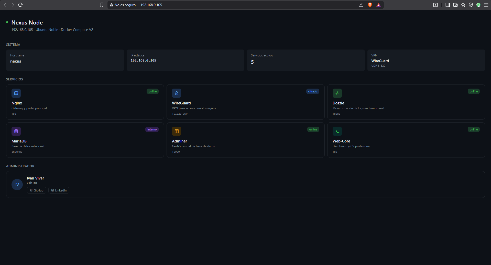

# 🚀 Nexus Node - Personal Infrastructure & IaC


[](https://www.linkedin.com/in/ivan-vivar-tirado-354445335/)
[](https://github.com/x1b1t0)
[](https://ivanvivartirado.github.io)

Este repositorio contiene la configuración y automatización de **Nexus Node** (anteriormente Sputnik), una infraestructura personal diseñada bajo principios de **Infrastructure as Code (IaC)** y arquitectura de microservicios, optimizada para la seguridad y el acceso remoto cifrado.
## 📸 Vista del Dashboard



## 🏗️ Arquitectura del Sistema

El laboratorio corre sobre una máquina virtual con **Ubuntu Noble**, gestionada mediante **Docker Compose V2** y protegida por un túnel VPN persistente.

### Especificaciones de Red
- **Hostname:** `nexus`
- **IP Estática:** `192.168.0.105` (Configurada vía Netplan)
- **Acceso Externo:** Túnel VPN WireGuard (UDP 51820)

## 🌐 Stack de Servicios (Docker Compose)

Utilizo un modelo de arquitectura distribuida para garantizar la observabilidad y el servicio:

* **Gateway (Nginx):** Punto de entrada principal (puerto 80).
* **Web-Core:** Servidor Nginx que aloja el Dashboard de control y el CV profesional.
* **WireGuard:** Servidor VPN para acceso remoto seguro, evitando la exposición de puertos críticos a Internet.
* **Dozzle:** Interfaz de observabilidad para monitorización de logs en tiempo real (puerto 8888).
* **MariaDB & Adminer:** Stack de persistencia de datos y gestión visual de bases de datos (puerto 8080).

## 🛡️ Seguridad y Hardening

La infraestructura ha sido securizada siguiendo estándares de administración de sistemas:
- **Gestión de Identidades:** Migración de usuarios genéricos a cuenta administrativa dedicada `admin` con privilegios `sudo`.
- **Network Hardening:** Implementación de IP estática y DNS redundante (Google DNS) para evitar pérdida de conectividad.
- **Acceso Cifrado:** Uso de llaves SSH (`ed25519`) para autenticación sin contraseña y túnel VPN para administración remota.

## 📁 Estructura del Proyecto

```bash
.
├── web/
│   ├── index.html            # Portal principal (Nexus Core)
│   └── cv-admin.pdf          # Currículum profesional alojado
├── wireguard/                # Configuración de túneles y llaves VPN
├── docker-compose.yml        # Orquestación V2 de contenedores
├── .gitignore                # Protección de secretos y configs locales
└── README.md                 # Documentación del proyecto
## 🚀 Cómo desplegar el entorno

Sigue estos pasos para poner en marcha el nodo desde una instalación limpia de Ubuntu Server.

### 1. Preparación del Sistema
Antes de levantar los servicios, es necesario identificar la máquina en la red y asegurar una dirección IP persistente para evitar la rotura de enlaces y túneles VPN:

```bash
# Cambiar el nombre del host a Nexus
sudo hostnamectl set-hostname nexus

# Configurar Netplan para IP estática (192.168.0.105)
sudo netplan apply

2. Despliegue de Infraestructura
Utilizamos Docker Compose V2 para la orquestación. Gracias a la estructura de microservicios, el despliegue es atómico e independiente:

	# Entrar al directorio del proyecto (Alias recomendado: hl)
cd ~/mi-homelab

# Levantar todos los servicios en segundo plano
docker compose up -d

Nexus Node - Administrado por Ivan Vivar (x1b1t0)

